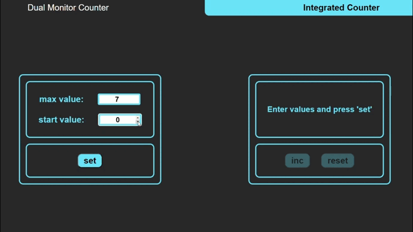
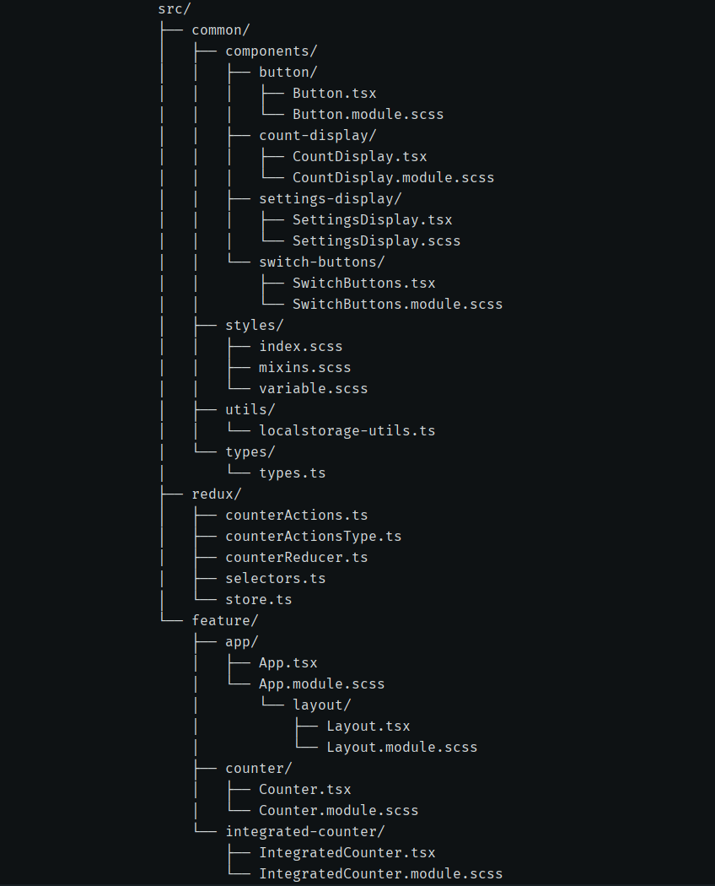

# :computer: Dual Counter App

### The Dual Counter Application is a simple web-based application that allows users to set the initial and maximum value of the counter, and then increment, decrement, and reset the counter, and also switch from a dual-monitor setup to an integrated one. The application is built using React, Redux, and TypeScript, and it utilizes the localStorage API to persist the counter's state between sessions.

### :link: The full working project can be found [here](https://dual-counter.netlify.app/)
___

### :white_check_mark: Key Features:
+ **Counter Functionality:**
  + Users can set the initial and maximum value of the counter, and then increment, decrement, and reset the counter. 
  + The counter's value is displayed on the screen.
  + Users can also switch from a dual-monitor setup to an integrated one.
+ **State Management:**
  + The application uses Redux to manage the state of the counter, ensuring that the state is updated consistently and efficiently.
+ **Persistence:**
  + The counter's state is saved to the browser's localStorage, allowing the user to continue from where they left off even after refreshing the page or closing the browser.
+ **Error Handling:**
  + The application includes error handling mechanisms to ensure that the counter's state is properly loaded and saved, and it provides feedback to the user in case of any issues.
+ **TypeScript:**
  + The entire project is written in TypeScript, which provides strong type checking and better tooling support, improving the overall code quality and maintainability.
+ **Responsive Design:**
  + The application is designed to be responsive and mobile-friendly
    Provides an optimal user experience across different devices and screen sizes

### :white_check_mark: Technology Stack:
+ react
  + react-redux
+ redux
+ typeScript
+ localStorage
+ sass
+ clsx
+ eslint

### :white_check_mark: Project Structure:

